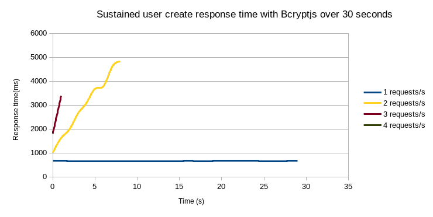
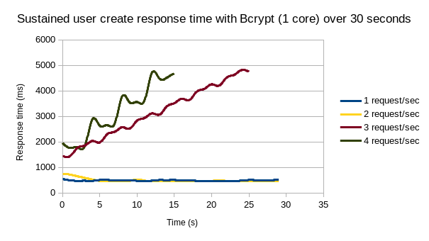
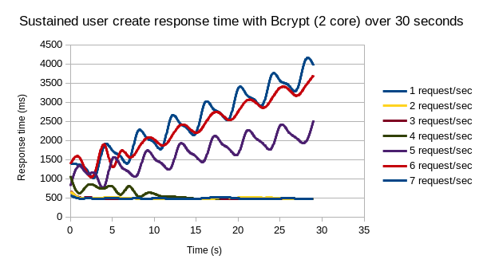
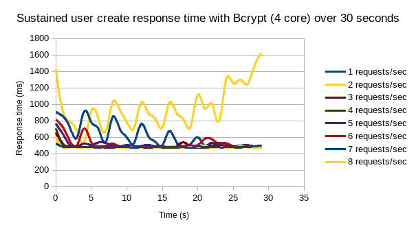

# Feathers Authentication Local Bcrypt vs Bcryptjs Test


## Results:
*All tests were run from within docker to allow for max cpu core limits*
- CPU: Intel 3770k (hyperthreading disabled)
- OS: Fedora 27


### Simultaneous requests
| - | Bcryptjs | Bcrypt (1 core) | Bcrypt (2 core) | Bcrypt (4 core) |
| --- | --- | --- | --- | --- |
| Max signups | 7 | 10 | 20 | 35 |
| Avg time (ms) | 4527 | 3967 | 2934 | 2737 |
| Min time (ms) | 4524 | 1971 | 951 | 658 |
| Max time (ms) | 4531 | 4783 | 4834 | 4878 |

*max signups is number of clients before a single timeout occurs*


### Simultaneous results
Fixed number of requests are fired together and the response times for each request is recorded

#### Bcryptjs
| Requests | 1 | 2 | 3 | 4 | 5 | 6 | 7 | 8 |
| --- | --- | --- | --- | --- | --- | --- | --- | --- |
| Avg time (ms) | 686 | 1335 | 1965 | 2605 | 3250 | 3902 | 4527 | TIMEOUT |
| Min time (ms) | 686 | 1333 | 1964 | 2603 | 3249 | 3900 | 4524 | - |
| Max time (ms) | 686 | 1337 | 1968 | 2608 | 3254 | 3906 | 4531 | - |

#### Bcrypt (1 core)
| Requests | 1 | 2 | 3 | 4 | 5 | 6 | 7 | 8 | 9 | 10 | 11 |
| --- | --- | --- | --- | --- | --- | --- | --- | --- | --- | --- | --- |
| Avg time (ms) | 502 | 958 | 1448 | 1896 | 2019 | 2242 | 2540 | 2871 | 3038 | 3967 | TIMEOUT |
| Min time (ms) | 502 | 956 | 1445 | 1895 | 1924 | 1921 | 1929 | 1928 | 1942 | 1971 | TIMEOUT |
| Max time (ms) | 502 | 960 | 1451 | 1898 | 2389 | 2863 | 3334 | 3800 | 4269 | 4783 | TIMEOUT |

#### Bcrypt (2 core)
| Requests | 1 | 2 | 3 | 4 | 5 | 6 | 7 | 8 | 9 | 10 | 15 | 20 | 21 |
| --- | --- | --- | --- | --- | --- | --- | --- | --- | --- | --- | --- | --- | --- |
| Avg time (ms) | 505 | 493 | 648 | 819 | 1086 | 1133 | 1276 | 1414 | 1595 | 1679 | 2314 | 2934 | TIMEOUT |
| Min time (ms) | 505 | 491 | 488 | 501 | 990 | 861 | 904 | 622 | 1017 | 592 | 569 | 951 | 1099 | 951 | 1099 |
| Max time (ms) | 505 | 494 | 730 | 985 | 1462 | 1484 | 1736 | 1964 | 2369 | 2453 | 3687 | 4834 | 4851 |

#### Bcrypt (4 core)
| Requests | 1 | 2 | 3 | 4 | 5 | 6 | 7 | 8 | 9 | 10 | 15 | 20 | 25 | 30 | 35 | 36 |
| --- | --- | --- | --- | --- | --- | --- | --- | --- | --- | --- | --- | --- | --- | --- | --- | --- |
| Avg time (ms) | 503 | 495 | 509 | 527 | 620 | 708 | 737 | 816 | 967 | 1023 | 1390 | 1689 | 2048 | 2458 | 2737 | TIMEOUT |
| Min time (ms) | 503 | 492 | 508 | 516 | 516 | 525 | 525 | 553 | 540 | 542 | 577 | 585 | 607 | 700 | 672 | 658 |
| Max time (ms) | 503 | 497 | 510 | 541 | 991 | 1030 | 1012 | 1111 | 1517 | 1626 | 2305 | 2928 | 3596 | 4252 | 4836 | 4878 |

### Sustained results
A fixed number of requests are fired per second for 30 seconds, the response times for each request is recorded

#### Bcryptjs


#### Bcrypt (1 core)


#### Bcrypt (2 core)


#### Bcrypt (4 core)


## Setup
```
npm install
```

## Run server with bcryptjs

```
npm start
```

## Run server with bcrypt

```
npm run start:bcrypt
```

## Run simultaneous client
*Performs # requests all at once*

```
npm run client
// allows env variables
// NUMBER OF USERS=# (default: 5)
// BCRYPT=1 OR 0 (1 = bcrypt, 0 = bcryptjs, default = 0)
```

## Run sustained client
*Performs # requests per second over a duration*

```
npm run client:
// allows env variables
// REQUESTS PER SECOND (any number, default 5)
// DURATION (any number, default 30 seconds)
```

## Run server with bcrypt in docker

```
docker build --network=host --cpuset-cpus=0,1,2,3 -f Dockerfile.bcrypt -t feathers-auth-local-bcrypt .
// change --cpuset-cpus=0 for single core
// I have no clue why it's running off the build command ¯\_(ツ)_/¯
```
